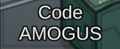

# Boot.Codes

Boot.Codes is an Impostor plugin that reads lists of 4 or 6 character long words, and will assign them to lobbies when they are created. Once the lists are exhausted, game codes will be assigned "randomly", as usual.

The advantage of this is that you have more recognizable names for your games, which makes it easier to communicate codes to others.

## Installation

To install the plugin, you need [Impostor](https://github.com/Impostor/Impostor) 1.4 build 178 or newer, which can be obtained from AppVeyor.

You can now install the plugin. Just download `Boot.Codes.dll` from the [Github Releases](https://github.com/miniduikboot/Boot.Codes/releases) and put it in your `plugins` folder.

To make the plugin useful you need a list of game codes. You may write your own, or you could download one of the wordlists provided in [our repository](https://github.com/miniduikboot/Boot.Codes-lists).

When writing your own word lists, keep in mind that codes can only be 4 or 6 characters in length and only contain letters from A up to and including Z.
​Wordlists may include comments with a prefix of `--`. Lines starting with the sequence will be ignored, but lines with codes may contain comments, as long as the game code precedes the comment.

The wordlist(s) must be put in the server's directory in a folder called `Boot.Codes`. The full path is printed out when starting Impostor with the plugin installed.

### Usage

Once you have correctly installed it, you should see a message in the console when the server is starting, showing how many codes were loaded. If you see a message indicating that no codes were loaded, your wordlists are invalid. You may also see messages warning you of invalid codes.

If any codes were loaded, every new lobby will take a code from the lists randomly. Though, you can only have as many custom lobbies as you have words. Once there are more lobbies than the number of codes, normal codes will start being assigned again.

## Showcase

## Credits

- Empireu for taking this plugin from the prototype stage to something useful.
- Minorusama for creating the API this plugin relies on.
