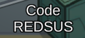

# Boot.Codes

## 1. What does it do?

This Impostor plugin reads a list of 6/4 character long words, and will assign them to lobbies when they are created. Once the list is exhausted, game codes are assigned randomly, as usual.

## 2. How to use it?

### 	1. Prerequisites

​	To install the plugin, you need Impostor 1.4+, which can be obtained from AppVeyor. Then, you 	need a list of game codes. You may write your own, or you could download one of the wordlists provided in the repository. Keep in mind that codes can only be 4 or 6 characters in length.

​	Wordlists may include comments with a prefix of `--`. Lines starting with the sequence will be ignored, but lines with codes may contain comments, as long as the game code precedes the comment.

​	The wordlist must be put on the server's root, under the name `Boot.Codes.txt`.

​	After you have a compatible Impostor server, and a wordlist, you may download the latest release and add the DLL to `plugins` folder.

### 2. Usage

​	Once you have correctly installed it, you should see a message in the console when the server is starting, showing how many codes were loaded. If you see a message indicating that no codes were loaded, your wordlist is invalid. You may also see messages warning you of invalid codes.

​	If any codes were loaded, every new lobby will take a code from the list randomly. Though, you can only have as many custom lobbies as you have words. Once there are more lobbies than the number of codes, normal codes will start being assigned again.

## 3. Showcase

